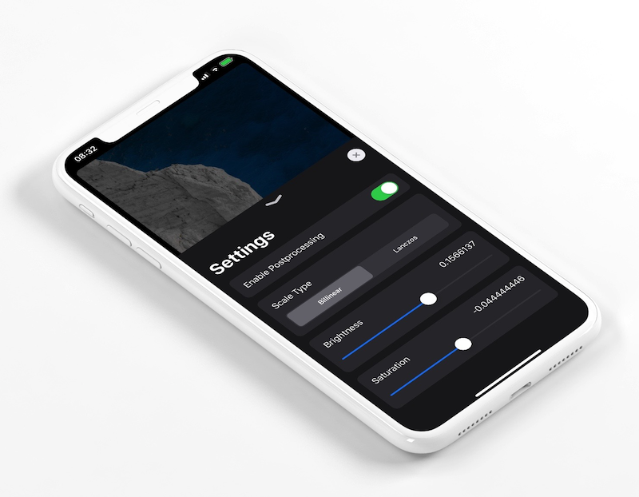

# SettingsViewController

Add settings to your app with a few lines of code.



## Requirements

* iOS 11.0 or later
* Swift 5.2

## Usage

SettingsViewController is capable to handle `Bool`, `Float` and `Selection` types of settings.

```swift
let settingsViewController = SettingsViewController(settings: [
    BoolSetting(name: "Enable Postprocessing",
                initialValue: true) { isPostprocessingEnabled in
                    self.enablePostprocessing(isPostprocessingEnabled)
    },
    SelectionSetting(name: "Scale Type",
                     initialValue: 0,
                     segments: ["Billinear", "Lanczos"]) { scaleType in
                        self.setScaleType(scaleType)
    },
    FloatSetting(name: "Brightness",
                 initialValue: 0,
                 min: -1,
                 max: 1) { brightness in
                    self.setBrightness(brightness)
    },
    FloatSetting(name: "Saturation",
                 initialValue: 0,
                 min: -1,
                 max: 1) { saturation in
                    self.setSaturation(saturation)
    },
])

```

# References

The project is based and based on [DebugMenu](https://github.com/s1ddok/DebugMenu)'s [options](https://github.com/s1ddok/DebugMenu/tree/master/Framework/DebugMenu/Options) implementation.

## License

[MIT](LICENSE)
